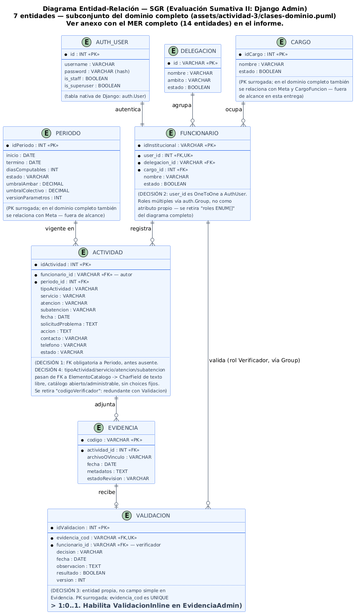
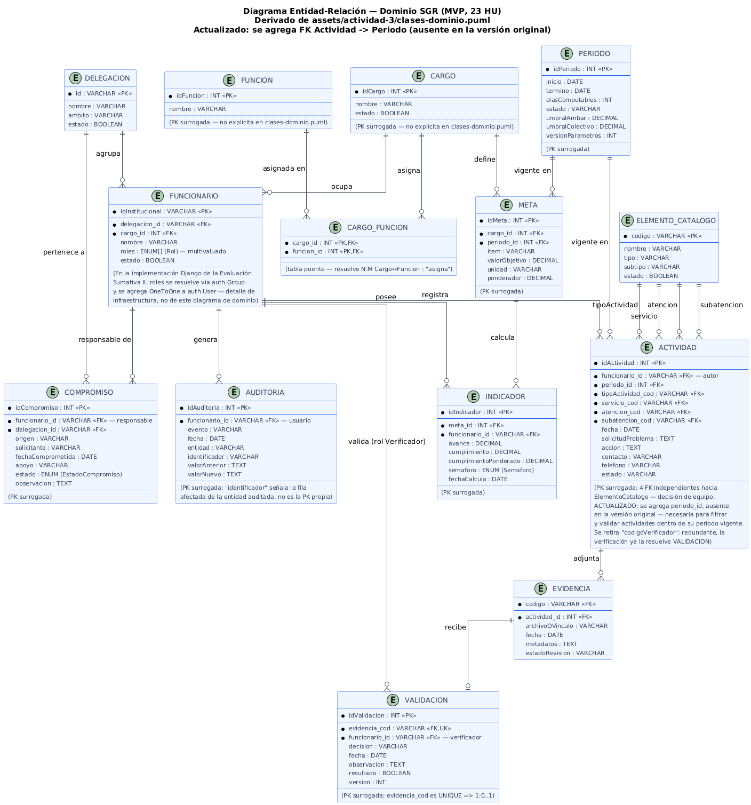

# SGR — Sistema de Gestión de Resultados (Backend Django)

Proyecto de Evaluación Sumativa II — Programación Back End (TI3041).
Caso: Delegaciones municipales, I. Municipalidad de La Serena.

## Requisitos previos
- Python 3.10+ (probado con 3.12)
- Git

No se requiere instalar un motor de base de datos aparte: el proyecto usa SQLite, incluido con Python.

## Instalación
Repositorio: [SGR---Backend](https://github.com/Ren-reno/SGR---Backend)

```powershell
git clone https://github.com/Ren-reno/SGR---Backend
cd SGR---Backend
python -m venv .venv
.\.venv\Scripts\Activate.ps1
pip install -r requirements.txt
```

## Variables de entorno
```powershell
copy .env.example .env
```
Completar `.env` con valores reales. Generar una `SECRET_KEY` nueva con:
```powershell
python -c "from django.core.management.utils import get_random_secret_key; print(get_random_secret_key())"
```

| Variable | Descripción |
|---|---|
| `SECRET_KEY` | Clave secreta de Django |
| `DEBUG` | `True` en desarrollo |
| `DB_ENGINE` | `django.db.backends.sqlite3` |
| `DB_NAME` | Nombre del archivo de base de datos (`db.sqlite3`) |

## Base de datos
El archivo `db.sqlite3` se genera automáticamente al correr las migraciones — no requiere creación previa.

## Migraciones
```powershell
python manage.py migrate
```

## Carga de datos de prueba

El proyecto trae un comando de seed **idempotente** (se puede correr varias veces sin duplicar datos
ni fallar contra las restricciones `on_delete=PROTECT` — ver Decisión 8 de `docs/decisiones.md`):

```powershell
python manage.py migrate
python manage.py seed_sgr
```

Crea, vía `get_or_create`: los 4 grupos de rol (Administrador, Delegado, Funcionario, Verificador),
2 Delegaciones ficticias, 3 Cargos, las 3 cuentas de prueba de la tabla de abajo (cada una con su
`Funcionario` asociado), 1 Período vigente, 2 Actividades (una por Delegación), 2 Evidencias con
archivo real adjunto, y 1 Validación de ejemplo.

Si se quiere partir de una base completamente limpia (único reset soportado — no borrar filas sueltas
desde el Admin, ver Decisión 8):
```powershell
Remove-Item db.sqlite3
python manage.py migrate
python manage.py seed_sgr
```

## Levantar el servidor
```powershell
python manage.py runserver
```
Entrar a **http://127.0.0.1:8000/admin/** (no a `http://127.0.0.1:8000/` sin más — este backend
no tiene una vista pública en la raíz, solo el Django Admin, así que `/` da 404 por diseño).

## Cuentas de prueba

Credenciales ficticias, generadas por `seed_sgr` — nunca se usan credenciales personales en este
repositorio (Decisión 5 de `docs/decisiones.md`).

| Usuario | Contraseña | Rol (grupo) | Delegación |
|---|---|---|---|
| `admin_sgr` | `sgr-demo-2026` | Administrador (superuser) | Delegación Centro |
| `funcionario_demo` | `sgr-demo-2026` | Funcionario | Delegación Norte |
| `verificador_demo` | `sgr-demo-2026` | Verificador | Delegación Centro |

La contraseña se puede cambiar al correr el seed con `python manage.py seed_sgr --password <otra>`.

## Documentación del proyecto

Documentación interna del equipo, en `docs/`:

| Documento | Contenido |
|---|---|
| `docs/decisiones.md` | Decisiones de diseño y alcance de esta entrega (7 entidades), con alternativas descartadas y su justificación |
| `docs/Plan_Proyecto_SGR_Fusionado.md` | Plan de trabajo por fases y reparto real del equipo |
| `docs/Guia_Proyecto_Software_SGR_Alumnos.md` | Documento fuente completo del caso SGR (MVP completo, 23 HU). No describe el alcance de este repo — se incluye por trazabilidad. Para el alcance real de esta entrega, ver `decisiones.md` |
| `docs/enunciado.md` | Enunciado completo de la Evaluación Sumativa II (rúbrica, criterios y requerimientos de las 100 pts) — la Fase 1 de este repo cubre el criterio "Conexión BD + Migraciones" (9 pts) |

## Diagramas ER (modelo de datos)

Estos diagramas son la fuente de la que sale el modelo de datos que se implementa en Fase 2
(`models.py`) — tipos de dato, relaciones y FK. La fuente editable es el `.puml` de cada uno
(cualquier visor/plugin de PlantUML); la imagen de abajo es un render fijo para que se vea
directo en GitHub, así que si se edita el `.puml` hay que regenerar la imagen.

### MER de esta entrega — 7 entidades (Evaluación Sumativa II: Django Admin)



Fuente editable: [`docs/assets/mer_evaluacion_2_django_admin.puml`](docs/assets/mer_evaluacion_2_django_admin.puml).
Ya incorpora las Decisiones 1–4 de `docs/decisiones.md`: FK obligatoria `Actividad → Período`,
`Funcionario` con `OneToOneField` a `auth.User`, `Validación` como entidad propia (no campo simple
en `Evidencia`), y los 4 campos de clasificación de `Actividad` como texto libre (sin FK a un
catálogo cerrado).

### MER completo del dominio — 14 entidades (MVP, 23 HU)



Fuente editable: [`docs/assets/mer_general_mvp.puml`](docs/assets/mer_general_mvp.puml).
Diseño de referencia para entregas futuras (incluye `Función`, `CargoFuncion`, `Meta`,
`ElementoCatalogo`, `Compromiso`, `Indicador`, `Auditoría`) — **no** es el alcance de este repo.

Ante cualquier diferencia entre estos diagramas y `docs/decisiones.md`, `decisiones.md` manda — es el
documento vivo que se actualiza primero.

#### Cómo regenerar las imágenes tras editar un `.puml`

Requiere Java. Desde la raíz del repo:
```powershell
java -jar plantuml.jar -tpng docs/assets/mer_evaluacion_2_django_admin.puml docs/assets/mer_general_mvp.puml -o .
```
(descargar `plantuml.jar` desde https://plantuml.com/download si no está en el equipo; no se
versiona en el repo, solo el resultado `.png`).