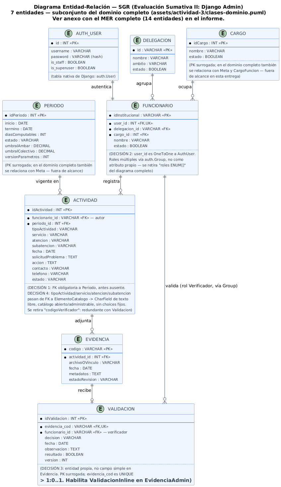
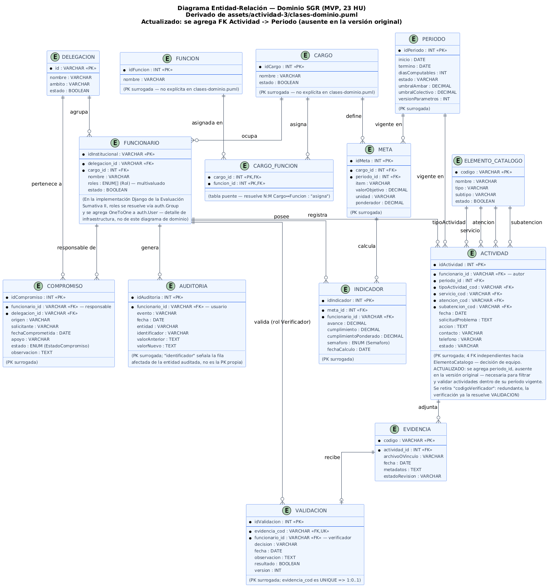

# SGR — Sistema de Gestión de Resultados (Backend Django)

Proyecto de Evaluación Sumativa II — Programación Back End (TI3041).
Caso: Delegaciones municipales, I. Municipalidad de La Serena.

## Requisitos previos
- Python 3.10+ (probado con 3.12)
- Git

No se requiere instalar un motor de base de datos aparte: el proyecto usa SQLite, incluido con Python.

## Instalación
Repositorio: [SGR---Backend](https://github.com/Ren-reno/SGR---Backend)

```powershell
git clone https://github.com/Ren-reno/SGR---Backend
cd SGR---Backend
python -m venv .venv
.\.venv\Scripts\Activate.ps1
pip install -r requirements.txt
```

## Variables de entorno
```powershell
copy .env.example .env
```
Completar `.env` con valores reales. Generar una `SECRET_KEY` nueva con:
```powershell
python -c "from django.core.management.utils import get_random_secret_key; print(get_random_secret_key())"
```

| Variable | Descripción |
|---|---|
| `SECRET_KEY` | Clave secreta de Django |
| `DEBUG` | `True` en desarrollo |
| `DB_ENGINE` | `django.db.backends.sqlite3` |
| `DB_NAME` | Nombre del archivo de base de datos (`db.sqlite3`) |

## Base de datos
El archivo `db.sqlite3` se genera automáticamente al correr las migraciones — no requiere creación previa.

## Migraciones
```powershell
python manage.py migrate
```

## Carga de datos de prueba

El proyecto trae un comando de seed **idempotente** (se puede correr varias veces sin duplicar datos
ni fallar contra las restricciones `on_delete=PROTECT` — ver Decisión 8 de `docs/decisiones.md`):

```powershell
python manage.py migrate
python manage.py seed_sgr
```

Crea, vía `get_or_create`: los 4 grupos de rol (Administrador, Delegado, Funcionario, Verificador),
2 Delegaciones ficticias, 3 Cargos, las 3 cuentas de prueba de la tabla de abajo (cada una con su
`Funcionario` asociado), 1 Período vigente, 2 Actividades (una por Delegación), 2 Evidencias con
archivo real adjunto, y 1 Validación de ejemplo.

Si se quiere partir de una base completamente limpia (único reset soportado — no borrar filas sueltas
desde el Admin, ver Decisión 8):
```powershell
Remove-Item db.sqlite3
python manage.py migrate
python manage.py seed_sgr
```

## Levantar el servidor
```powershell
python manage.py runserver
```
Rutas disponibles:

| Ruta | Qué es |
|---|---|
| `/` | Portada: un enlace a cada listado según tus permisos (requiere sesión; sin ella redirige al login) |
| `/accounts/login/` | Inicio de sesión |
| `/accounts/logout/` | Cierre de sesión (solo `POST`; se dispara con el botón "Cerrar sesión") |
| `/accounts/forgot-password/` | Recuperación de contraseña, paso 1: generar el código |
| `/accounts/reset-password/` | Recuperación de contraseña, paso 2: código + contraseña nueva |
| `/admin/` | Django Admin |

Tras iniciar sesión se llega a la **portada** (`/`), igual para todos los roles. Muestra un enlace a
cada listado (Actividades, Evidencias, Validaciones, Compromisos) solo si tu cuenta tiene el permiso
de **ver** esa entidad, y un enlace al Admin solo si eres *staff*. Si tu cuenta no tiene acceso a
ningún módulo (hoy, el grupo Delegado), la portada lo avisa en vez de quedar en blanco. El logo del
encabezado vuelve a la portada desde cualquier pantalla. Ver Decisión 27 en `docs/decisiones.md`.

La zona horaria del proyecto es `America/Santiago` (`TIME_ZONE`): "hoy", en las reglas de fecha de
los formularios, es la fecha de Chile y no la de UTC.

## Recuperación de contraseña

Flujo por código numérico de 6 dígitos (Decisión 20 de `docs/decisiones.md`):

1. Ir a `/accounts/forgot-password/` e ingresar el usuario.
2. **Modo demo:** no se envía correo. Con `DEBUG=True` el código aparece **en pantalla**, y siempre
   queda visible en el Admin (`Accounts › Password reset codes`, solo lectura). Con `DEBUG=False`
   el código **nunca** llega a la respuesta HTTP (en un despliegue real se enviaría por correo).
3. Ir a `/accounts/reset-password/`, ingresar usuario, código y la contraseña nueva **dos veces**.

Reglas del código: vence a los **10 minutos**, es de **un solo uso** (tras una recuperación
exitosa no sirve de nuevo), pedir uno nuevo invalida el anterior, y se **bloquea a los 5 intentos
fallidos**.

Reglas de la contraseña nueva: mínimo **10 caracteres**, con **mayúscula, minúscula, número y
carácter especial**. Se guarda hasheada (PBKDF2 de Django), nunca en texto plano.

> Las contraseñas de las cuentas de prueba de abajo (`sgr-demo-2026`) **no cumplen** esa regla a
> propósito: el seed las fija con `set_password()`, que no pasa por los validadores. La regla se
> aplica al *cambiar* la contraseña, no al iniciar sesión. Tras recuperarla, la cuenta queda con una
> contraseña que sí la cumple.

## Pruebas automáticas
```powershell
python manage.py test
```

## CRUD web (en construcción)

Este patch entrega la **base común** del CRUD web de las 4 entidades operativas
(`Activity`, `Evidence`, `Validation`, `Commitment`): todavía no hay ninguna vista de
negocio, solo las dos piezas que reutilizarán las 4 vistas de listado cuando se agreguen:

- **`performance/scoping.py` — `DelegationScopedQuerysetMixin`.** Extiende a las vistas
  web el mismo scoping por Delegación que ya funciona en el Admin (un Administrador, sea
  superuser o del grupo `Administrador`, ve todo; cualquier otro usuario, solo lo de su propia
  Delegación). La regla es `is_unrestricted(user)`, compartida con el Admin (Decisión 31).
- **`performance/pagination.py` — `SessionPaginationMixin`.** Paginación con `Paginator`,
  tamaño elegible entre **5 / 15 / 30**, recordado en `request.session`. Un valor fuera de
  ese conjunto se ignora (normaliza), no se rechaza con error.
- **`templates/performance/partials/pagination.html`** y **`templates/base.html`**
  extendido con las clases de tabla/paginación que usarán las 4 vistas.

Ver Decisión 21 en `docs/decisiones.md` para el detalle completo, incluidos dos errores
reales que aparecieron al probarlo por HTTP y quedaron corregidos con test de regresión.

### Actividades (paso 6.1)

Primer CRUD de negocio sobre esa base. Requiere sesión iniciada (sin ella redirige al login):

| URL | Qué hace | Permiso de Django |
|---|---|---|
| `/activities/` | Listado paginado (5 / 15 / 30) de las actividades de tu Delegación | `view_activity` |
| `/activities/new/` | Alta | `add_activity` |
| `/activities/<id>/edit/` | Edición (una actividad de otra Delegación responde 404) | `change_activity` |
| `/activities/<id>/delete/` | Eliminación lógica: solo `POST`, con confirmación SweetAlert2 (ver abajo) | `delete_activity` |

Son los mismos permisos que ya asigna `seed_sgr` a cada grupo: **Administrador** hace todo;
**Funcionario** y **Verificador** ven y editan, pero no crean ni eliminan; **Delegado** aún no tiene ninguno.

El listado se abre desde la portada (`/`), que lo enlaza a quien tiene `view_activity`, o entrando
directo a `/activities/`. Ver Decisiones 22 y 27 en `docs/decisiones.md`.

### Evidencias (paso 6.2)

Mismo patrón que Actividades, sobre `Evidence`:

| URL | Qué hace | Permiso de Django |
|---|---|---|
| `/evidences/` | Listado paginado (5 / 15 / 30) de las evidencias de tu Delegación, con enlace al archivo | `view_evidence` |
| `/evidences/new/` | Alta con archivo (formulario `multipart/form-data`) | `add_evidence` |
| `/evidences/<código>/edit/` | Edición (una evidencia de otra Delegación responde 404) | `change_evidence` |
| `/evidences/<código>/delete/` | Eliminación lógica: solo `POST`, con confirmación SweetAlert2 (ver *Eliminación*) | `delete_evidence` |

Con lo que asigna `seed_sgr`: **Administrador** hace todo; **Funcionario** y **Verificador** ven y
editan, pero no crean ni eliminan (crear y eliminar evidencias hoy es solo del Administrador); **Delegado**
no tiene ninguno.

Tres particularidades de `Evidence` que conviene conocer antes de la demo:

- **El código lo genera el sistema y no se puede cambiar** (RF-011, RN-010): al crear no se escribe,
  se asigna al guardar con el formato `EVID-0001`, `EVID-0002`... (el siguiente número libre; una
  evidencia eliminada conserva el suyo y no se reutiliza). Al editar se muestra como dato, y un código
  que llegue por POST se ignora, en la web y en el Admin. Es la clave primaria (Decisión 33).
- **El estado de revisión no se edita aquí.** Lo fija el flujo de validación; si el formulario lo
  permitiera, quien carga una evidencia podría marcarla "Aprobada" (RN-009). Es un conjunto cerrado
  de tres valores (Pendiente, Aprobada, Rechazada; Decisión 30) y en el Admin se elige de un desplegable.
- **El archivo se exige al crear**; al editar, si no se sube otro se conserva el actual. La
  validación de tamaño, extensión y contenido real del archivo llega en la Fase 8.

La fecha de la evidencia no puede ser futura ni anterior a la de su actividad. Ver Decisión 23 en
`docs/decisiones.md`.

### Validaciones (paso 6.3)

Tercer CRUD sobre la misma base. Requiere sesión iniciada (sin ella redirige al login):

| URL | Qué hace | Requiere |
|---|---|---|
| `/validations/` | Listado paginado (5 / 15 / 30) de las validaciones de tu Delegación | `view_validation` |
| `/validations/new/` | Alta | `add_validation` **y** ser Verificador o Administrador |
| `/validations/<id>/edit/` | Edición (una validación de otra Delegación responde 404) | `change_validation` **y** ser Verificador o Administrador |
| `/validations/<id>/delete/` | Eliminación lógica: solo `POST`, con confirmación SweetAlert2 (ver *Eliminación*) | `delete_validation` **y** ser Verificador o Administrador |

Igual que en el Admin: **Administrador** hace todo; **Verificador** ve, crea y edita las de su
Delegación (no elimina); **Funcionario** y **Delegado** no acceden. Reglas que valida el servidor:

- La decisión es `Aprobada`, `Rechazada` o `Corrección solicitada`; el resultado se deriva de ella.
- La observación es obligatoria al rechazar o pedir corrección.
- La fecha no puede ser futura ni anterior a la de la evidencia.
- Una evidencia solo puede tener una validación (no se ofrecen las ya validadas) y debe tener archivo.
- Al editar, la evidencia no se puede cambiar.

Crear o editar una validación **no** cambia el estado de revisión de la evidencia (solo lo hace la
acción "aprobar evidencias en lote" del Admin). La eliminación se describe en la sección
*Eliminación* (Decisión 29). Ver Decisión 24 en `docs/decisiones.md`, incluidos los supuestos por confirmar.

### Compromisos (paso 6.4)

Mismo patrón que Actividades. Requiere sesión iniciada (sin ella redirige al login):

| URL | Qué hace | Permiso de Django |
|---|---|---|
| `/commitments/` | Listado paginado (5 / 15 / 30) de los compromisos de tu Delegación | `view_commitment` |
| `/commitments/new/` | Alta | `add_commitment` |
| `/commitments/<id>/edit/` | Edición (un compromiso de otra Delegación responde 404) | `change_commitment` |
| `/commitments/<id>/delete/` | Eliminación lógica: solo `POST`, con confirmación SweetAlert2 (ver *Eliminación*) | `delete_commitment` |

Permisos según `seed_sgr` (Decisión 18): **Administrador** y **Funcionario** ven, crean y editan
(el Funcionario, solo de su Delegación) y solo el Administrador elimina; **Verificador** y **Delegado** reciben 403. Los
desplegables *Delegación* y *Responsable* solo ofrecen la Delegación propia y sus empleados; la
Delegación del responsable debe coincidir con la elegida. Además se valida que la fecha
comprometida no sea anterior a hoy (al registrar o al cambiarla) y que no exista otro compromiso
con el mismo responsable, fecha, origen, solicitante y territorio. La eliminación se describe en la sección
*Eliminación* (Decisión 28). Ver Decisión 25 en `docs/decisiones.md`, que también lista los supuestos sin
confirmar (uno de ellos, sobre la zona horaria, quedó resuelto en la Decisión 27).

**Registros inactivos.** Los desplegables *Delegación* y *Responsable* ofrecen solo registros activos
(`is_active`). Al editar se conserva el valor que el compromiso ya tenía aunque hoy esté inactivo, para
que un compromiso antiguo siga pudiéndose guardar. Si la Delegación de tu cuenta está inactiva no queda
ninguna para elegir: no puedes registrar compromisos nuevos, pero sí editar los existentes. El Admin no
aplica este filtro. Siguen como limitaciones conocidas que el responsable se puede reasignar dentro de la
propia Delegación (HU-15 queda fuera de alcance) y que el chequeo de duplicados en SQLite solo ignora
mayúsculas en ASCII (`PÉREZ` no coincide con `Pérez`). Ver Decisión 32 en `docs/decisiones.md`.

### Eliminación (Fase 7, patches 12, 14 y 15)

Cada fila del listado de Actividades, Evidencias, Validaciones y Compromisos muestra un botón **Eliminar** solo a
quien tiene el permiso `delete_<modelo>` (hoy solo el grupo **Administrador**); en Validaciones se exige además
ser Verificador o Administrador, igual que en el Admin. Al pulsarlo aparece una confirmación de **SweetAlert2**; solo si
se confirma se envía un formulario `POST` con token CSRF.

- **La confirmación no es la seguridad.** El servidor vuelve a verificar todo en cada `POST`: sin sesión
  redirige al login, sin permiso responde 403, un registro de otra Delegación responde 404, sin token
  CSRF 403 y un `GET` a la URL de eliminar 405.
- **Borrado lógico:** el registro no se borra, se marca `deleted_at` y deja de aparecer en el sistema
  (`performance/soft_delete.py`). Una actividad con evidencias vivas no se puede eliminar: se muestra un
  mensaje pidiendo eliminar primero sus evidencias, que ahora se eliminan desde `/evidences/`; el orden
  completo (evidencias y luego actividad) se hace desde la web.
- **Al eliminar una evidencia también se elimina su validación**, si la tiene. El diálogo lo avisa siempre
  ("Si tiene una validación, también se eliminará."), tenga o no validación, para no consultarlo fila por
  fila en el listado. Un compromiso no tiene efectos en cascada.
- **Eliminar una validación es de sentido único desde la web.** La evidencia queda sin validación y **no puede
  volver a validarse desde la web**: `/validations/new/` no la ofrece, porque una evidencia solo admite una
  validación y la fila eliminada sigue ocupando ese lugar. El diálogo lo avisa. Solo se revierte restaurando la
  fila desde la consola (`restore()`). Eliminar una validación no cambia el estado de revisión de la evidencia
  ni la elimina. Un usuario con `delete_validation` pero sin rol de Verificador o Administrador recibe 403, y una
  validación cuya evidencia es de otra Delegación responde 404 (el alcance lo da la evidencia, no el verificador).
- **Sin CDN:** SweetAlert2 v11.26.25 (MIT) viaja dentro del repositorio, en
  `performance/static/performance/vendor/sweetalert2/`, junto con su licencia. Sin JavaScript el botón no
  elimina nada.
- **Estado por entidad:** las 4 entidades tienen eliminación web: `Activity` (patch 12), `Evidence` y
  `Commitment` (patch 14) y `Validation` (patch 15).
- **Estáticos y despliegue:** es el primer archivo estático del proyecto. Con `DEBUG=True`, `runserver` lo
  sirve; para el despliegue hará falta `STATIC_ROOT` y `collectstatic` (pendiente de la Fase 9).

Ver Decisiones 26, 28 y 29 en `docs/decisiones.md`; la 26 también registra el borrado lógico de la Fase 3 y
reemplaza las Decisiones 12 y 18 en lo que decían sobre no poder borrar `Validation` ni `Commitment`.

## Cuentas de prueba

Credenciales ficticias, generadas por `seed_sgr` — nunca se usan credenciales personales en este
repositorio (Decisión 5 de `docs/decisiones.md`).

| Usuario | Contraseña | Rol (grupo) | Delegación |
|---|---|---|---|
| `admin_sgr` | `sgr-demo-2026` | Administrador (superuser) | Delegación Centro |
| `funcionario_demo` | `sgr-demo-2026` | Funcionario | Delegación Norte |
| `verificador_demo` | `sgr-demo-2026` | Verificador | Delegación Centro |

La contraseña se puede cambiar al correr el seed con `python manage.py seed_sgr --password <otra>`.

### Qué puede hacer cada usuario en el Admin

Sale de la tabla de actores de la Guía (sección 3); el detalle y la justificación están en la
Decisión 18 de `docs/decisiones.md`.

| Modelo | `admin_sgr` (Administrador) | `funcionario_demo` (Funcionario) | `verificador_demo` (Verificador) |
|---|---|---|---|
| `Activity`, `Evidence` | todo | ver y editar, solo de su Delegación | ver y editar, solo de su Delegación |
| `Validation` | ver, agregar, editar | sin acceso | ver, agregar, editar |
| `Commitment` | ver, agregar, editar (todas las Delegaciones) | ver, agregar, editar, **solo de su Delegación** | sin acceso |
| `Meta`, `CatalogItem` | control total | sin acceso | sin acceso |

Nadie puede borrar `Validation` ni `Commitment` desde el Admin, ni siquiera el Administrador
(Decisiones 12 y 18): el borrado de compromisos será lógico.

Un `403` al abrir `Meta` o `CatalogItem` con `funcionario_demo` **no es un error**: son datos de
configuración que la Guía reserva al Administrador.

## Documentación del proyecto

Documentación interna del equipo, en `docs/`:

| Documento | Contenido |
|---|---|
| `docs/decisiones.md` | Decisiones de diseño y alcance de esta entrega (10 entidades, Decisión 15), con alternativas descartadas y su justificación |
| `docs/Plan_Proyecto_SGR_Fusionado.md` | Plan de trabajo por fases y reparto real del equipo |
| `docs/Guia_Proyecto_Software_SGR_Alumnos.md` | Documento fuente completo del caso SGR (MVP completo, 23 HU). No describe el alcance de este repo — se incluye por trazabilidad. Para el alcance real de esta entrega, ver `decisiones.md` |
| `docs/enunciado.md` | Enunciado completo de la Evaluación Sumativa II (rúbrica, criterios y requerimientos de las 100 pts) — la Fase 1 de este repo cubre el criterio "Conexión BD + Migraciones" (9 pts) |

## Diagramas ER (modelo de datos)

Estos diagramas son la fuente de la que sale el modelo de datos que se implementa en Fase 2
(`models.py`) — tipos de dato, relaciones y FK. La fuente editable es el `.puml` de cada uno
(cualquier visor/plugin de PlantUML); la imagen de abajo es un render fijo para que se vea
directo en GitHub, así que si se edita el `.puml` hay que regenerar la imagen.

### MER de esta entrega — 7 entidades (Evaluación Sumativa II: Django Admin)



Fuente editable: [`docs/assets/mer_evaluacion_2_django_admin.puml`](docs/assets/mer_evaluacion_2_django_admin.puml).
Ya incorpora las Decisiones 1–4 de `docs/decisiones.md`: FK obligatoria `Actividad → Período`,
`Funcionario` con `OneToOneField` a `auth.User`, `Validación` como entidad propia (no campo simple
en `Evidencia`), y los 4 campos de clasificación de `Actividad` como texto libre (sin FK a un
catálogo cerrado).

### MER completo del dominio — 14 entidades (MVP, 23 HU)



Fuente editable: [`docs/assets/mer_general_mvp.puml`](docs/assets/mer_general_mvp.puml).
Diseño de referencia para entregas futuras (incluye `Función`, `CargoFuncion`, `Meta`,
`ElementoCatalogo`, `Compromiso`, `Indicador`, `Auditoría`). De esas 7, `Meta`, `ElementoCatalogo`
(como `CatalogItem`) y `Compromiso` (como `Commitment`) **ya están implementadas** en este repo
(Decisión 15); `Función`, `CargoFuncion`, `Indicador` y `Auditoría` son alcance de la Eva 3.

Ante cualquier diferencia entre estos diagramas y `docs/decisiones.md`, `decisiones.md` manda — es el
documento vivo que se actualiza primero.

#### Cómo regenerar las imágenes tras editar un `.puml`

Requiere Java. Desde la raíz del repo:
```powershell
java -jar plantuml.jar -tpng docs/assets/mer_evaluacion_2_django_admin.puml docs/assets/mer_general_mvp.puml -o .
```
(descargar `plantuml.jar` desde https://plantuml.com/download si no está en el equipo; no se
versiona en el repo, solo el resultado `.png`).

## Volumen de datos de prueba (Fase 8)

Además del seed curado (`seed_sgr`, usado para la demostración en vivo), el proyecto incluye
un segundo comando que agrega volumen sin tocar los datos curados:

\`\`\`powershell
python manage.py seed_sgr              # primero, si no lo has corrido
python manage.py generate_volume_data  # agrega ~1.000 registros adicionales
\`\`\`

Parámetros opcionales: `--activities`, `--evidences`, `--commitments` (por defecto 700/250/50).